# 云南大学 2021级人工智能 医疗实训项目-期末仓库

+ 小组成员
> 20211060245 陈俊宏  
> 20211060143 李俊杰  
> 20211060203 周楷翔  
> 20211120259 朱　荣  
> 20211060007 宋成宇  

## 一、头部CT伪影识别

+ 项目结构
```sh
./头部CT伪影识别
│   KNN.py
│
├───ErrorDetection(DeepLearning)
│       dataset_errordetect.py
│       dataset_imbalance.py
│       KCN.py
│       KNN.py
│       LOF_best.py
│       train_1class.py
│       train_1class_KAN.py
│       VGG_KCN.py
│
├───ErrorDetection(LOF)
│       dataset_L2.py
│       LOF_best.py
│
├───VGG+KAN二分类
│       dataset_L2.py
│       KCN.py
│       train.py
│
└───resource
```
+ 如需运行代码，请阅读代码数据处理有关内容，并将数据集正确存放到对应位置。相关分类结果和训练图表保存在 [./头部CT伪影识别/resource/](./头部CT伪影识别/resource/) 文件夹下，可自主查看。

### 1. Classification With VGG16+KAN

<center>
        <table>
        <caption><strong>模型性能表</strong></caption>
        <tr>
        <th></th>
        <th>Precision</th>
        <th>Recall</th>
        <th>F1-score</th>
        </tr>
        <tr>
        <td>Good</td>
        <td>1.0</td>
        <td>0.74</td>
        <td>0.85</td>
        </tr>
        <tr>
        <td>Bad</td>
        <td>0.05</td>
        <td>1.0</td>
        <td>0.11</td>
        </tr>
        </table>
</center>

<p align="center"><strong>训练曲线</strong></p>

<center>
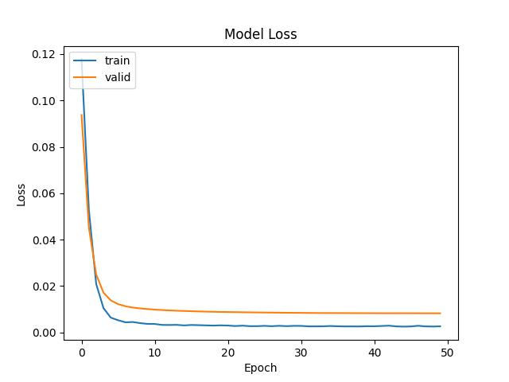
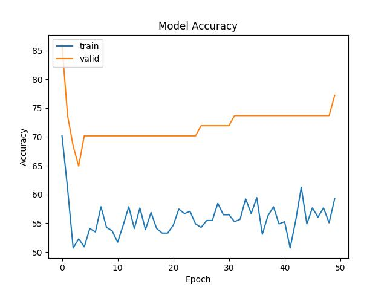
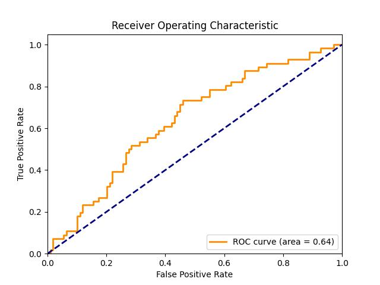
</center>

详细代码请查看 [./头部CT伪影识别/VGG+KAN二分类/](./头部CT伪影识别/VGG+KAN二分类/)


### 2. Error Detection With LOF(Local Outlier Factor)

<p align="center"><strong>LOF最终分类效果</strong></p>  

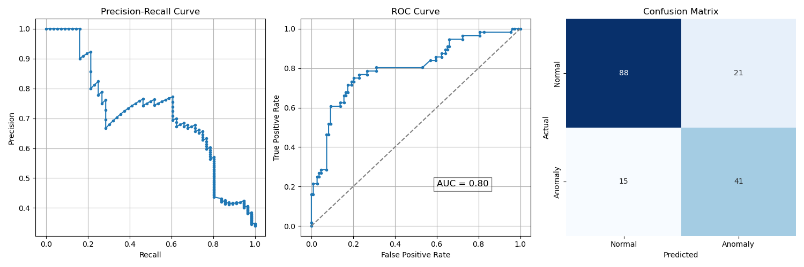

<p align="center"><strong>LOF PCA降维数据分布展示</strong></p>  

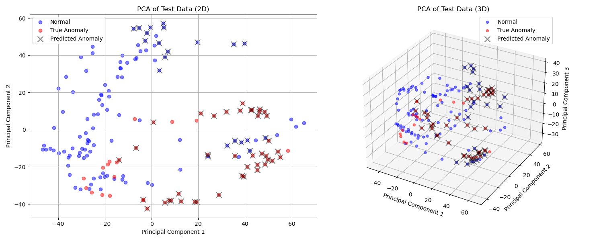

详细代码请查看 [./头部CT伪影识别/ErrorDetection(LOF)/](./头部CT伪影识别/ErrorDetection(LOF)/)


### 3. Error Detection With VGG16+KAN
<p align="center"><strong>VGG16+KAN 异常检测效果</strong></p>  

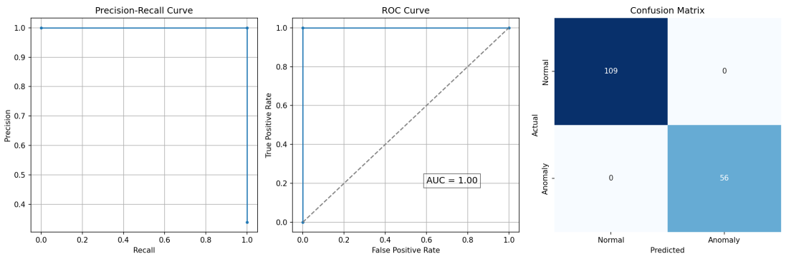

<p align="center"><strong>VGG16+KAN PCA降维数据分布展示</strong></p>  

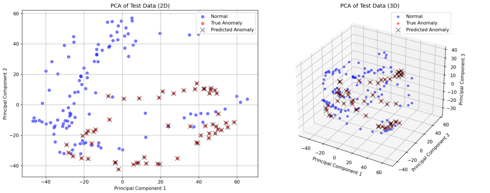

详细代码请查看 [./头部CT伪影识别/ErrorDetection(DeepLearning)/](./头部CT伪影识别/ErrorDetection(DeepLearning)/)


## 医学影像分割

+ 项目结构
```sh
./医学影像分割
│   Level3.ipynb
│
├───mask_former
│   │   dataset.py
│   │   model.py
│   │   split.py
│   │   test.py
│   │   train_mix.py
│   │   train_transormer.py
│   │
│   └───models
│           new8_model.pth
│           new_model_xinshi.pth
│           nf_mix_model.pth
│
└───resource
```

+ 相关分割结果和训练图表保存在 [./医学影像分割/resource](./医学影像分割/resource/) 文件夹下，可自主查看。

### 1. 使用自己搭建（或预训练）的主干模型 + U-Net进行分割

在 [./医学影像分割/Level3.ipynb](./医学影像分割/Level3.ipynb) 文件中，已经包含以下内容的所有代码与运行结果：

+ Segmentation With VGG16+U-Net(Single Modal)
+ Segmentation With VGG16+U-Net(Multi Modal)
+ Segmentation With ResNet50+U-Net(Multi Modal)

如需运行 jupyter notebook 中的相关代码，请根据代码中数据处理相关部分，将需要的文件夹、文件结构以及数据集正确创建和存放到到对应位置。

<p align="center"><strong>分割结果示例</strong></p> 

<center>
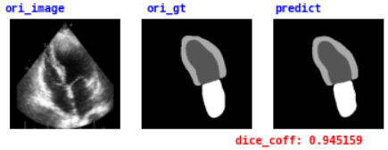
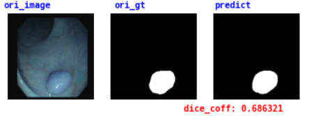
</center>


### 2. 使用自己搭建（或预训练）的主干模型 + Mask-Former进行分割

在 [./医学影像分割/mask_former/](./医学影像分割/mask_former/) 文件夹下，已经包含以下内容的所有代码与部分运行结果：

+ Segmentation With VGG16+U-Net(Single Modal)
+ Segmentation With VGG16+U-Net(Multi Modal)
+ Segmentation With ResNet50+U-Net(Multi Modal)

如需运行相关代码，请根据代码中数据处理相关部分，将需要的文件夹、文件结构以及数据集正确创建和存放到到对应位置。

<p align="center"><strong>多模态训练曲线</strong></p>  

<center>
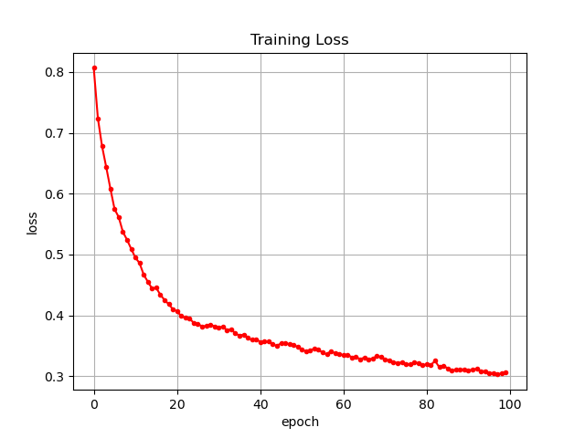
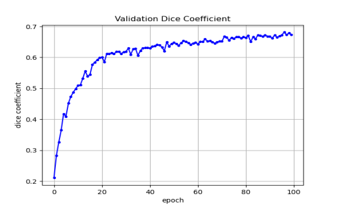
</center>

<p align="center"><strong>多模态分割结果示例</strong></p>  

<center>
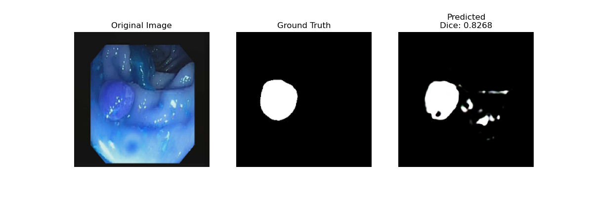
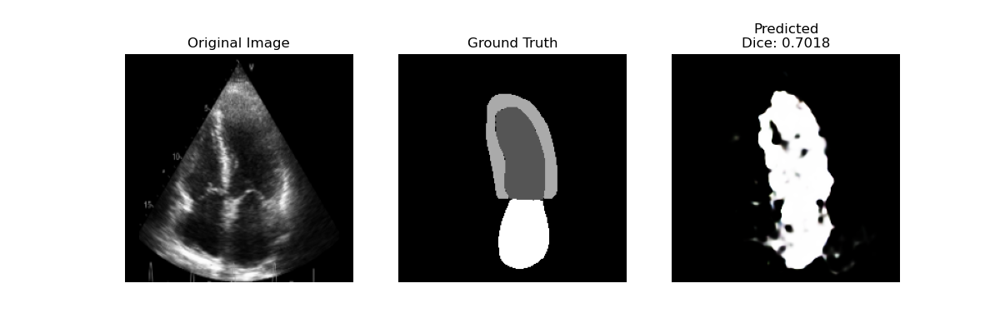
</center>